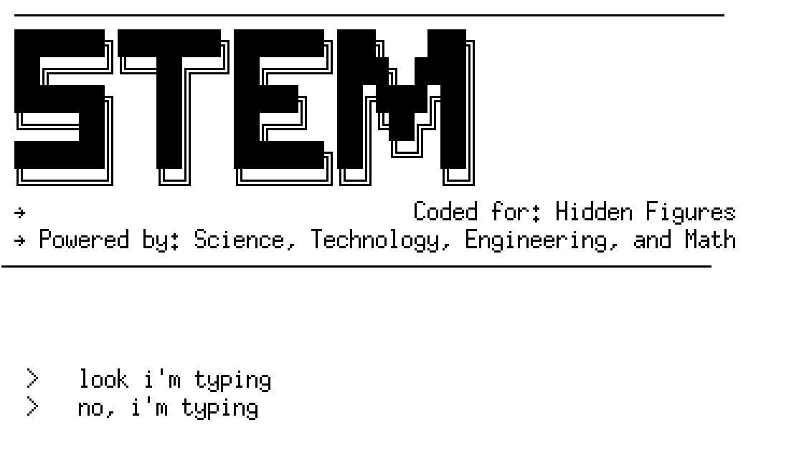
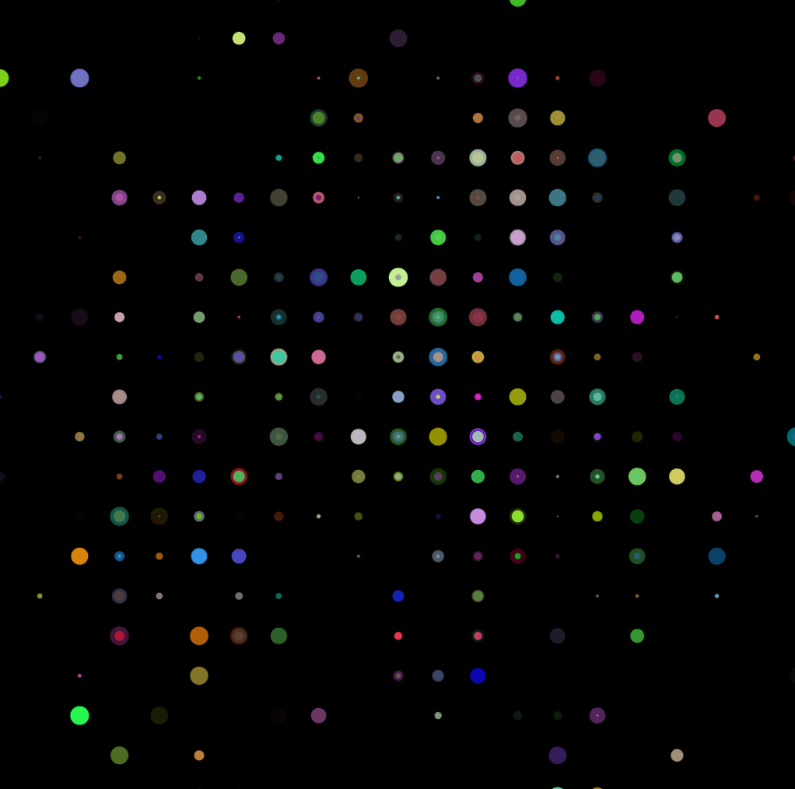
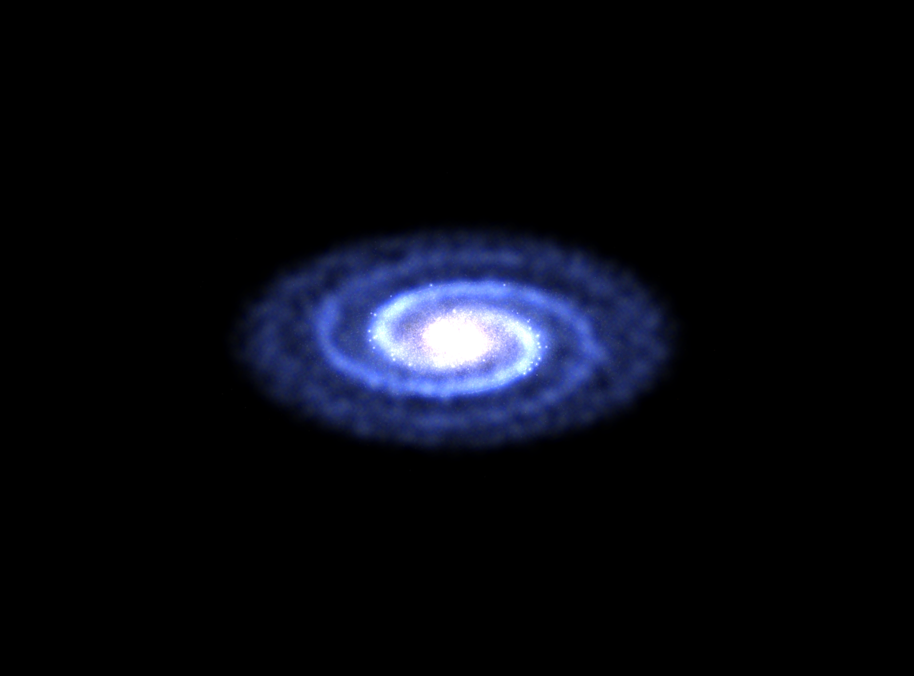
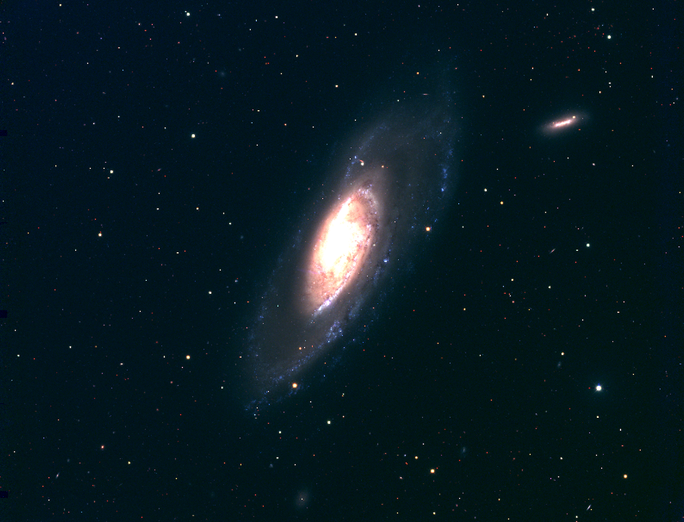
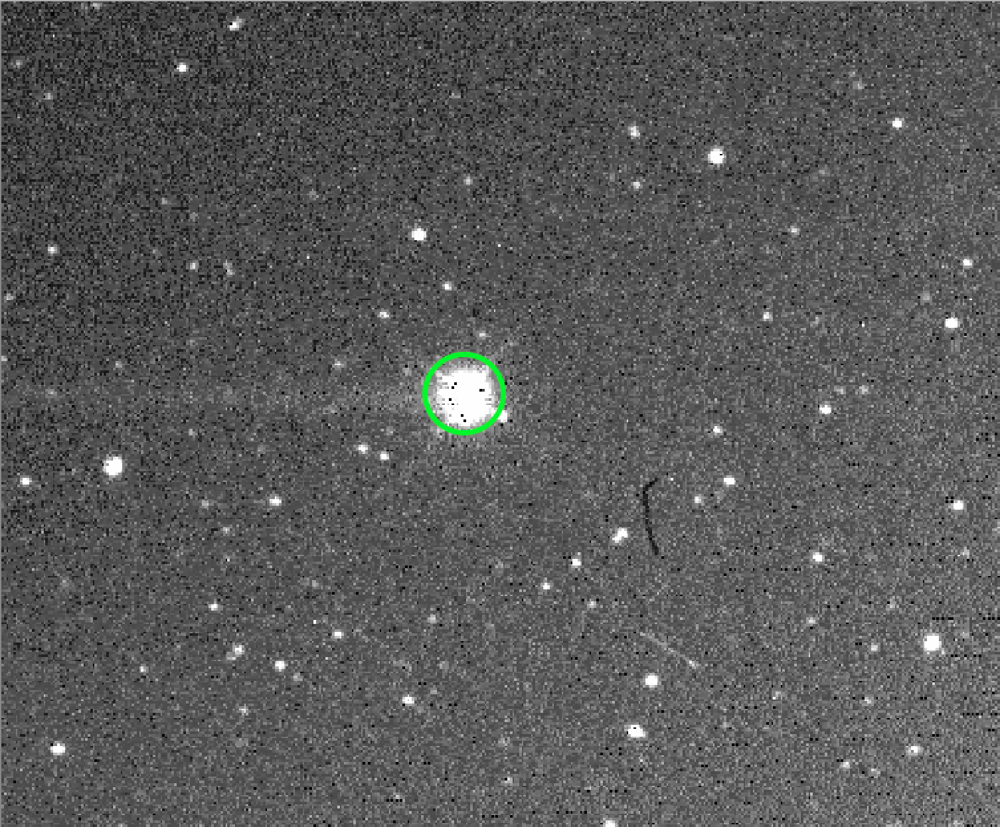
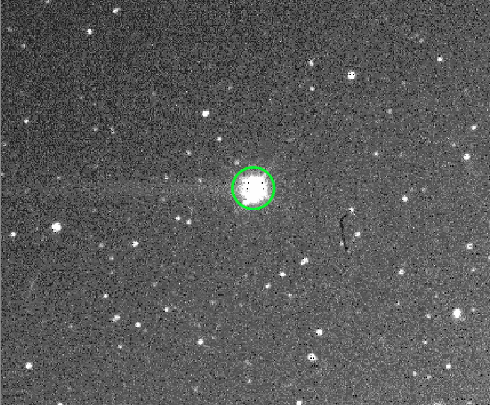

hidden-figures-video
====================

This repo has instructions and code for reproducing the visualizations and audio clips in my 'search for hidden figures' video about STEM.

| Instructions                                                           | Still frame                                             | Code                                                               |
|------------------------------------------------------------------------|---------------------------------------------------------|--------------------------------------------------------------------|
| [Typing in a terminal](scripts#typing-in-a-terminal)                   |                         | [scripts/terminal.py](scripts/terminal.py)                         |
| [Creating entropy viz](scripts#scripts#creating-entropy-visualization) |                    | [scripts/create-entropy.py](scripts/create-entropy.py)             |
| [Creating order viz](scripts#scripts#creating-order-visualization)     |                      | [scripts/create-order.py](scripts/create-order.py)                 |
| [Galaxy zoom viz](scripts#galaxy-zoom-visualization)                   |                       | [scripts/galaxy-zoom.py](scripts/galaxy-zoom.py)                   |
| [Earth zoom out viz](scripts#earth-zoom-out-visualization)             |                         | [scripts/earth-viz.py](scripts/earth-viz.py)                       |
| [Creating entropy music](scripts#creating-entropy-music)               | [`entropy.wav`](scripts/entropy.wav)                    | [scripts/create-entropy-music.py](scripts/create-entropy-music.py) |
| [Galaxy NGC 4258](scripts#galaxy-ngc-4258)                             |                         | (screenshot)                                                       |
| [Dwarf planet Ceres](scripts#dwarf-planet-ceres)                       |   | (screenshots)                                                      |

### Dependencies

All code is written for Python 3, specifically Python 3.5.2.

Most of the video clips I made using the very nice `Glumpy` project, which is OpenGL + Numpy for scientific visualization, building off of the examples:

-	Glumpy website: http://glumpy.github.io/
-	Glumpy source code: https://github.com/glumpy/glumpy

The audio clip of 'entropy' is randomly generated notes using the very nice `Pyo` project, which is a digital signal processing module:

-	Pyo website: http://ajaxsoundstudio.com/software/pyo/
-	Pyo source code: https://github.com/belangeo/pyo).

### Code

Instructions and scripts can be found in the [`scripts`](scripts) directory.
